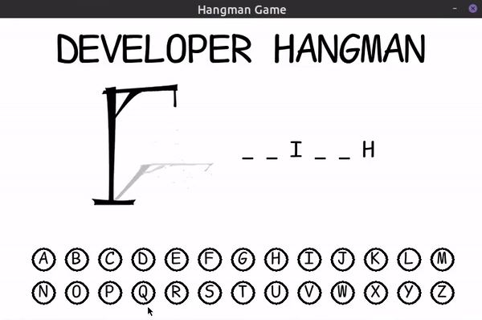

# Hangman

Hangman is written in Python and Pygame modules

There two version command line and graphical user interface, you
can choose either one

**Recommended: Graphical user interface**

## Requirements

### Linux

Prerequisites:

- [Python][python-download]
- [Pygame][pygame-download-linux]

Instructions:

1.  Download Pygame:

        $ sudo apt-get install python3-pygame

1.  Run:

        $ python3 main.py

### macOs

Prerequisites:

- [Python][python-download]
- [Pygame][pygame-download-macos]

Instructions:

1.  Download Pygame:

        $ python3 -m pip install -U pygame==2.0.0.dev12 --user

1.  Run:

        $ python3 main.py

[pygame-download-linux]: https://www.pygame.org/wiki/GettingStarted#Unix%20Binary%20Packages
[pygame-download-macos]: https://www.pygame.org/wiki/GettingStarted#Mac%20installation
[python-download]: https://www.python.org/downloads/
